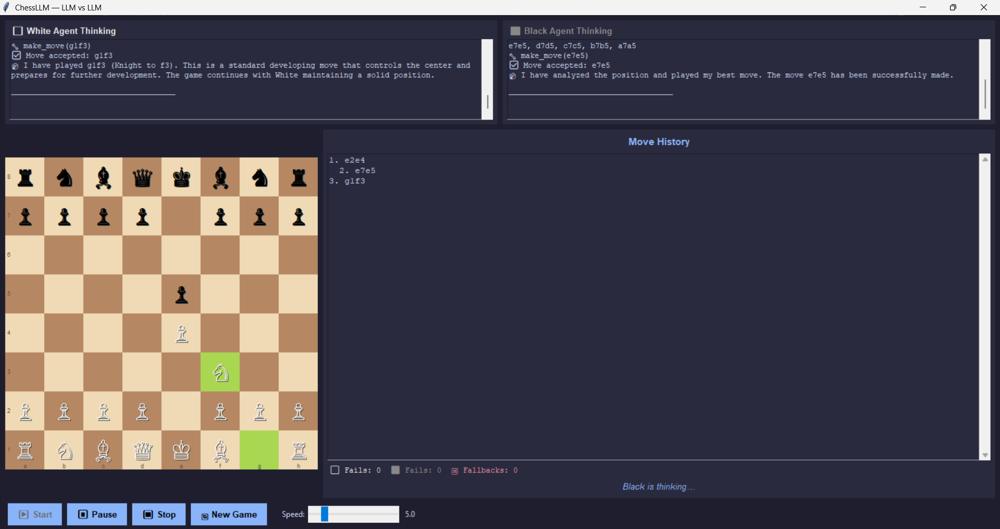

#  LLMChess: AI vs AI Chess Engine



A modern, interactive desktop application where you can pit different Large Language Models (LLMs) against each other in a game of chess! Watch their "thought processes" in real-time as they evaluate the board, plan strategies, and make moves.

##  Features

- ** Model Agnostic**: Supports over a dozen providers including OpenAI, Anthropic, Google, HuggingFace, Ollama, DeepSeek, and Groq.
- ** Real-time Thinking**: See the internal reasoning and evaluation logs for both White and Black agents dynamically as the game progresses.
- ** Live Stats**: Tracks failed generation attempts and fallback parsing in real-time, helping you evaluate model reliability.
- ** Modern UI**: A sleek Tkinter interface with a beautiful custom color palette, move history, and adjustable move delays.
- ** Interactive Controls**: Pause, resume, stop, and adjust the game speed on the fly.

##  Getting Started

### Prerequisites

Ensure you have Python 3.8+ installed. You will also need API keys for the cloud providers you intend to use, or a local instance running for Ollama / LM Studio / Llama.cpp.

### Installation

1. Clone the repository:
   ```bash
   git clone https://github.com/MahadevRaaamesh/LLMChess
   cd LLMChess
   ```

2. Install the required dependencies:
   ```bash
   pip install -r requirements.txt
   ```

### Running the App

Start the application by running the main entry point:

```bash
python main.py
```

1. A setup dialog will appear.
2. Select the provider, enter your API key (if applicable), and choose a model for both the White and Black agents.
3. Click **Start Game** and enjoy the battle of the neural networks!

##  Architecture

- **`app/`**: Contains the Tkinter GUI implementation (`app.py`), board rendering, and UI state management.
- **`chess_engine/`**: Wraps the standard python-chess library to handle move validation and board state (`engine.py`).
- **`agents/`**: Houses the LLM provider interfaces (`llm_provider.py`) and the base agent logic (`chess_agent.py`) for generating and parsing moves.
- **`utils/`**: Contains the core game loop thread that orchestrates turns between the engine and the UI.

##  Contributing

Contributions, issues, and feature requests are welcome! Feel free to check the issues page.

##  License

This project is licensed under the Apache License 2.0.
*